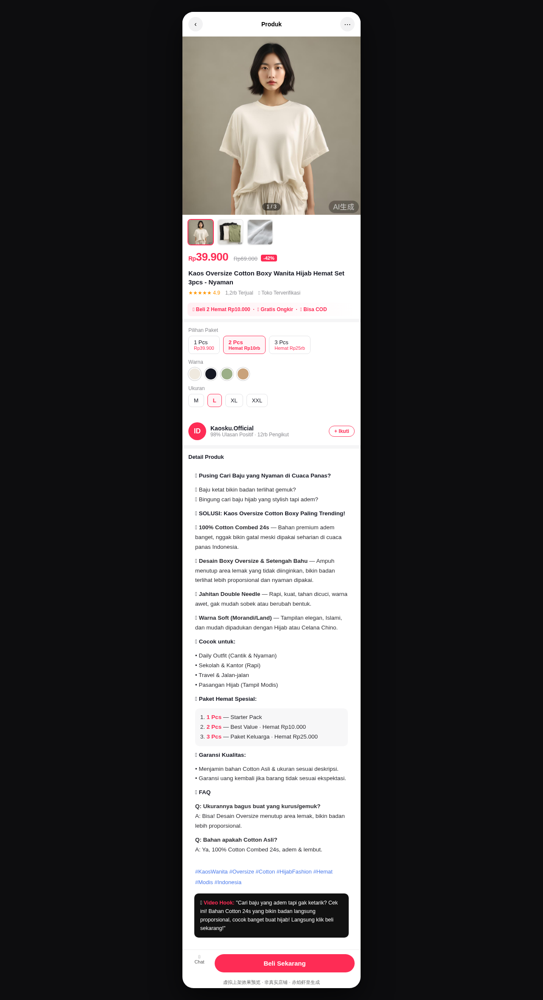

# TikTok 热榜采集器 · 本地四件套

云端产脚本 · 本地执行(遵守"云端不装浏览器内核"铁律)。

## 📦 文件
- `run_demo.py` — 主脚本(自包含)
- `requirements.txt` / `config.json` / `SETUP.md` — 依赖 / 配置 / 说明书

## 🚀 三步跑
```bash
pip install -r requirements.txt
playwright install chromium
python run_demo.py --login     # 首次登录 TikTok
python run_demo.py             # 采集印尼热销品榜
```

---

## 🛍 附: 虚拟上架效果预览(印尼 TikTok Shop)

> 用采集器定位品类后, 由 `tkshop-sea.py` 生成详情页, 再由云端渲染成"像真在 TikTok Shop 里"的效果图。**非真实店铺, 仅看效果。**



- 静态页面: [`listing-preview-ID.html`](listing-preview-ID.html)(可下载用浏览器打开)
- 商品图: `img/` 目录(由 AI 生成, 仅演示)
